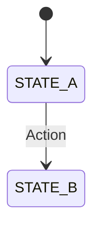

# Writing Design Docs

Making systems explicit so they can scale without tribal knowledge.

## CRITICAL: Documentation Sync Requirement

**When modifying code that has associated documentation, you MUST update the documentation in the same PR.**

### What Requires Doc Updates

| Code Change                  | Documentation to Update            |
| ---------------------------- | ---------------------------------- |
| Modify a documented feature  | `docs/features/{feature-name}/`    |
| Change architecture patterns | `docs/architecture/*.md`           |
| Update a library/package     | Package `README.md` if it exists   |
| Change API contracts         | Related feature docs               |
| Modify state management      | `docs/architecture/` if documented |

### How to Check for Related Docs

1. **Check for package README**: Look for `README.md` in the package directory
2. **Check for feature docs**: Search `docs/features/` for related feature names
3. **Check for architecture docs**: Search `docs/architecture/` for system names
4. **Check for inline references**: Grep for the function/component name in `docs/`

### Documentation Update Rules

1. **Update, don't rewrite** - Make targeted changes to existing docs
2. **Keep examples current** - If you change an API, update code examples
3. **Add new sections** - If adding functionality, add corresponding doc sections
4. **Note breaking changes** - Call out if the change affects existing behavior
5. **Update related docs** - If change affects multiple systems, update all relevant docs

### Packages with Documentation

| Package                  | Documentation                     |
| ------------------------ | --------------------------------- |
| `src/lib/google-sheets/` | `src/lib/google-sheets/README.md` |
| `src/lib/i18n/`          | `src/lib/i18n/README.md`          |

---

## Documentation Taxonomy

| Type             | Location                                         | Purpose                             |
| ---------------- | ------------------------------------------------ | ----------------------------------- |
| Feature Doc      | `docs/features/{feature-name}/{feature-name}.md` | What the feature does, how it works |
| Architecture Doc | `docs/architecture/*.md`                         | Cross-cutting systems and decisions |

---

## Feature Naming Convention

**CRITICAL**: Feature names must be explicit and descriptive. The name should fully describe what the feature does without requiring context.

### Rules

1. **Use full words, not abbreviations**: `checkout-subscription-flow` not `checkout-sub`
2. **Include the domain**: `cart-item-quantity-update` not `quantity-update`
3. **Describe the action or state**: `user-session-expiration-handling` not `session-stuff`
4. **Use kebab-case**: `apple-pay-quickpay-checkout` not `ApplePayQuickpay`
5. **Be specific about scope**: `product-grid-infinite-scroll` not `infinite-scroll`

### Examples

| Bad Name   | Good Name                           | Why                                          |
| ---------- | ----------------------------------- | -------------------------------------------- |
| `auth`     | `user-authentication-flow`          | Specifies it's about user auth, not API auth |
| `cart`     | `shopping-cart-persistence`         | Describes what aspect of cart                |
| `events`   | `event-mode-country-restriction`    | Specifies the exact feature                  |
| `checkout` | `checkout-payment-failure-recovery` | Describes the specific scenario              |

### Anti-patterns

- **Generic names**: `utils`, `helpers`, `misc`, `stuff`
- **Abbreviations without context**: `cfg`, `mgmt`, `proc`
- **Single words**: `payments`, `users`, `products`
- **Implementation details**: `redux-slice`, `api-hook`

---

## Feature Docs — Purpose/Behavior/Verify

Each feature gets a single file: `docs/features/{feature-name}/{feature-name}.md`

**IMPORTANT**: Feature docs are created AFTER the feature implementation is complete. Writing docs after ensures they reflect the actual implementation.

### Structure

Every feature doc follows this structure:

| Section  | Type                 | What it captures                                                    |
| -------- | -------------------- | ------------------------------------------------------------------- |
| Purpose  | Intent (WHO + WHY)   | "Prevent duplicate orders from re-uploads or webhook retries"       |
| Context  | Rationale (optional) | Risks avoided, standards followed, alternatives rejected            |
| Behavior | Outcomes (WHAT)      | "Customer uploads same CSV twice → only one order gets processed"   |
| Verify   | Test steps (HOW)     | Page, endpoint, or DB check with what to confirm                    |

**Format**:

```markdown
# {feature-name}

## Overview

1-2 sentences covering what this feature does.

## Features

- [Feature A](#feature-a)
- [Feature B](#feature-b)

---

### Feature A

**Purpose**: One sentence — what it does and why (compressed user story).

**Context** (optional): Risks avoided, standards followed, alternatives considered.

**Behavior**:
1. Trigger → outcome
2. Trigger → outcome

**Verify**:
1. **Covers B1**: Step description
   - **Page**: `/route/path`
   - Action to take
   - Confirm: What to check

---
```

### Writing Good Behaviors

Behaviors follow the pattern: **trigger → outcome**. Both halves are required.

**Good behaviors** — reads like a conversation:
- Customer submits an order with an expired card → payment fails, customer sees "Payment declined" with retry option
- Admin disables a payment method → customers no longer see it at checkout, in-flight orders using it still complete
- Customer changes shipping address after payment → new tax calculation runs, customer confirms updated total

**Bad behaviors** — too technical, reads like code:
- ~~`POST /orders` with duplicate `externalId` returns 409~~
- ~~Order entity transitions from `PENDING` to `FAILED` state~~
- ~~`calculateTax()` is invoked with updated `shippingAddress` payload~~

**Bad behaviors** — incomplete, missing outcome:
- ~~Customer enters their shipping address on the checkout page~~

Rewritten with outcome:
- Customer enters their shipping address → tax recalculated for the new address, updated total shown before proceeding

**The test**: Read the behavior aloud. If it sounds like a product requirement, it's good. If it sounds like a code comment, rewrite it.

### Features vs Implementation Details

A feature describes an outcome users or stakeholders care about, not how the system achieves it internally.

- Feature: "Orders show their channel origin" (Source Attribution)
- NOT a feature: "Orders are transformed to canonical format and queued to Inngest" (implementation detail)

Ask: "Would a stakeholder or consumer of this system care about this as a distinct capability?" If not, it belongs in the Overview, not as its own feature.

### Numbering and Referencing

Number behaviors when a feature has multiple scenarios so verify steps can reference them:

- B1. Customer pays with a valid card → order confirmed, confirmation email sent
- B2. Customer pays with an expired card → payment declined, customer prompted to retry

Verify steps reference which behaviors they cover: "Covers B1, B3"

### Verify Format Options

- **Page**: `/route/path` — what to do, what to confirm
- **POST/GET/etc**: `/api/endpoint` — request shape, response shape
- **DB**: table/query — what to check

---

## Architecture Docs

Cross-cutting system documentation at `docs/architecture/*.md`.

| Include                      | Exclude             |
| ---------------------------- | ------------------- |
| General problem context      | Code examples       |
| Key decisions with rationale | SQL queries         |
| System-level solutions       | TypeScript snippets |
| State diagrams (Mermaid)     | Function signatures |

### Format

````markdown
# [System Name]

## Overview

Brief description of the general problem this system solves and the solution approach.

## Key Decisions

| Decision | Choice | Why       |
| -------- | ------ | --------- |
| X        | Y      | Rationale |


````

---

## Full Example

```markdown
# checkout-payment-failure-recovery

## Overview

Handles payment failures during checkout by preserving cart state and allowing users to retry with alternative payment methods.

## Features

- [Payment Error Display](#payment-error-display)
- [Cart Preservation](#cart-preservation)
- [Alternative Payment Retry](#alternative-payment-retry)

---

### Payment Error Display

**Purpose**: Show customers a safe, actionable error message when payment fails so they can understand what happened and try again.

**Context**: Payment processor error details may contain sensitive information (decline codes, fraud flags). We show generic messages to avoid exposing this data.

**Behavior**:
1. Payment processor returns an error → customer sees a safe error message with retry option (no sensitive details exposed)
2. Payment processor times out → customer sees "Payment could not be processed" with retry option
3. Multiple consecutive failures → same error display each time, no lockout

**Verify**:
1. **Covers B1**: Trigger a payment decline
   - **Page**: `/checkout/payment`
   - Submit payment with a declined test card
   - Confirm: Error message shown, no decline code or processor details visible, retry button available

2. **Covers B2**: Trigger a timeout
   - **Page**: `/checkout/payment`
   - Submit payment with timeout test card
   - Confirm: Timeout message shown with retry option

---

### Cart Preservation

**Purpose**: Keep all cart items intact after a payment failure so customers don't have to rebuild their cart.

**Behavior**:
1. Payment fails → all cart items and quantities remain unchanged
2. Customer refreshes the page after payment failure → cart still intact (persisted to localStorage)
3. Session times out after payment failure → cart preserved but payment details must be re-entered

**Verify**:
1. **Covers B1, B2**: Check cart after failure and refresh
   - **Page**: `/checkout/payment`
   - Trigger payment failure, check cart contents
   - Refresh page, check cart contents again
   - Confirm: All items and quantities unchanged in both cases

---

### Alternative Payment Retry

**Purpose**: Let customers switch to a different payment method after a failure so they can still complete their purchase.

**Behavior**:
1. Payment fails with one method → customer can select a different payment method and retry without re-entering cart items
2. Customer switches from card to Apple Pay after failure → checkout continues with Apple Pay, no items lost

**Verify**:
1. **Covers B1, B2**: Switch payment method after failure
   - **Page**: `/checkout/payment`
   - Fail payment with card, switch to alternate method, complete checkout
   - Confirm: Order created successfully with alternate payment method
```
